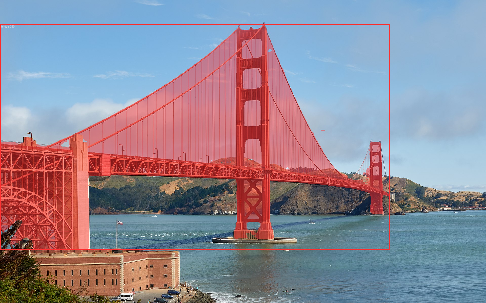

# SAM3 Inference API on Modal



Running SAM-3 by AI at Meta on Modal GPUs.

## Features

- **Image Segmentation**: Text-prompted image segmentation
- **Video Segmentation**: Text-prompted video frame segmentation across sequences

## Prerequisites

1. Modal account and installed CLI: https://modal.com
2. Python 3.9+
3. Dependencies (see pyproject.toml)

## Installation

```bash
pip install uv
uv sync
```

## Environment Keys

In a `.env` file:

```bash
IMAGE_ENDPOINT="<endpoint>"
VIDEO_ENDPOINT="<endpoint>"
```

And set up HuggingFace token secret on Modal:

```bash
uv run modal secret create huggingface HF_TOKEN="<HF TOKEN>"
```

## Deployment

Deploy to Modal:

```bash
uv run modal run modal_app.py
```

Or for a persistent deployment:

```bash
uv run modal deploy modal_app.py
```

Example inference:

```bash
uv run infer_golden_gate.py
```

## API Endpoints

### Health Check

**GET** `/health_check`

Simple health check endpoint.

```bash
curl https://your-workspace--sam3-inference-health-check.modal.run
```

Response:
```json
{
  "status": "healthy",
  "service": "sam3-inference"
}
```

### Image Inference

**POST** `/infer_image`

Perform segmentation on an image with a text prompt.

Request body:
```json
{
  "image_base64": "base64_encoded_image_data",
  "prompt": "dog"
}
```

Response:
```json
{
  "success": true,
  "data": {
    "masks": [...],
    "boxes": [...],
    "scores": [...]
  }
}
```

**Example using Python:**

```python
import base64
import requests

image_path = "path/to/image.jpg"
with open(image_path, "rb") as f:
    image_base64 = base64.b64encode(f.read()).decode()

response = requests.post(
    "https://your-workspace--sam3-inference-infer-image.modal.run",
    json={
        "image_base64": image_base64,
        "prompt": "cat",
    }
)

print(response.json())
```

**Example using cURL:**

```bash
# First, encode your image
IMAGE_B64=$(base64 -w 0 image.jpg)

# Then POST
curl -X POST https://your-workspace--sam3-inference-infer-image.modal.run \
  -H "Content-Type: application/json" \
  -d '{
    "image_base64": "'$IMAGE_B64'",
    "prompt": "dog"
  }'
```

### Video Inference

**POST** `/infer_video`

Perform segmentation on video frames with text prompts.

Two actions are supported:

#### 1. Start a video session

Request body:
```json
{
  "action": "start_session",
  "video_path": "/path/to/video.mp4"
}
```

Response:
```json
{
  "success": true,
  "data": {
    "session_id": "session_123456"
  }
}
```

#### 2. Add a prompt to the session

Request body:
```json
{
  "action": "add_prompt",
  "session_id": "session_123456",
  "frame_index": 0,
  "prompt": "person walking"
}
```

Response:
```json
{
  "success": true,
  "data": {
    "outputs": {...},
    ...
  }
}
```

**Example using Python:**

```python
import requests

endpoint = "https://your-workspace--sam3-inference-infer-video.modal.run"

# Start session
session_response = requests.post(
    endpoint,
    json={
        "action": "start_session",
        "video_path": "/path/to/video.mp4",
    }
)

session_id = session_response.json()["data"]["session_id"]

# Add prompt
prompt_response = requests.post(
    endpoint,
    json={
        "action": "add_prompt",
        "session_id": session_id,
        "frame_index": 0,
        "prompt": "dog",
    }
)

print(prompt_response.json())
```

## Usage Examples

See `client_example.py` for complete client implementations.

### Local Development

For local testing without Modal:

```python
from PIL import Image
from sam3.model_builder import build_sam3_image_model
from sam3.model.sam3_image_processor import Sam3Processor

# Load model
model = build_sam3_image_model()
processor = Sam3Processor(model)

# Load image
image = Image.open("image.jpg")

# Inference
inference_state = processor.set_image(image)
output = processor.set_text_prompt(state=inference_state, prompt="dog")

masks, boxes, scores = output["masks"], output["boxes"], output["scores"]
```

## Project Structure

```
.
├── modal_app.py           # Main Modal app with endpoints
├── client_example.py      # Example client code
├── pyproject.toml         # Dependencies
├── README.md              # This file
└── main.py                # Placeholder entry point
```

## Configuration

The app uses GPU "l40s" by default. To use a different GPU, modify `modal_app.py`:

```python
@app.cls(image=image, gpu="h100")  # Change "l40s" to desired GPU
class SAM3ImagePredictor:
    ...
```

## Troubleshooting

### Model download issues
If SAM3 model download fails, ensure you have sufficient disk space and network connectivity.

### GPU out of memory
Reduce batch sizes or use a larger GPU (h100 vs l40s).

### Endpoint timeout
For large images/videos, increase the function timeout:

```python
@app.function(timeout=600)  # 10 minutes
@modal.web_endpoint(method="POST")
async def infer_image(request_dict: dict) -> dict:
    ...
```

## License

MIT

## References

- [SAM3 GitHub](https://github.com/facebookresearch/sam3)
- [Modal Docs](https://modal.com/docs)
